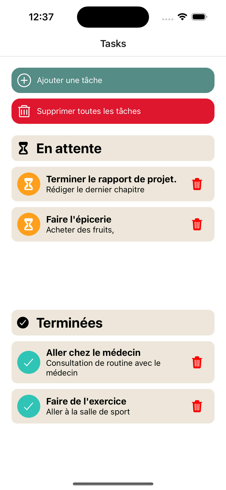

# Todo List

|   Nom   | Prénom |
|---------|--------|
|   Doe   |  Jane  |

Le TP est à réaliser individuellement.

## Technologies requises

Vous allez avoir besoin des technologies suivantes :
- [Android Studio](https://developer.android.com/studio "Android Studio") ainsi que la [JDK 20+](https://www.oracle.com/fr/java/technologies/downloads "JDK")
- [NodeJS LTS](https://nodejs.org/fr "NodeJS")

## Travail à réaliser

Accueil                                                           |  Ajout d'une tâche à réaliser
:----------------------------------------------------------------:|:-------------------------:
  |  

Le but de cette application est de créer un gestionnaire de tâches à réaliser (TAR).

L'application doit comprendre les fonctionnalités suivantes :

- [ ] Visualiser les TAR en cours et finalisées
- [ ] Supprimer l'ensemble des TAR
- [ ] Ajouter une TAR. Les TAR doivent persister.
- [ ] Possibilité de passser le statut d'une TAR `complétée` au statut `en cours` (et inversement)
- [ ] Possibilité de balayer (swipe) les TAR dans les listes pour les supprimer.

Il est bien sûr autorisé de donner du style à l'application. De plus, il est imposé d'utiliser `Expo.SecureStore` pour la persistance des données.

## Informations

Le projet a été créé l'aide de la commande suivante :

```shell
npx create-expo-app -t expo-template-blank-typescript
```

Il est possible de lancer l'application dans un émulateur Android et/ou iOS :

```shell
npx expo run:android  # npx expo run:ios
```
